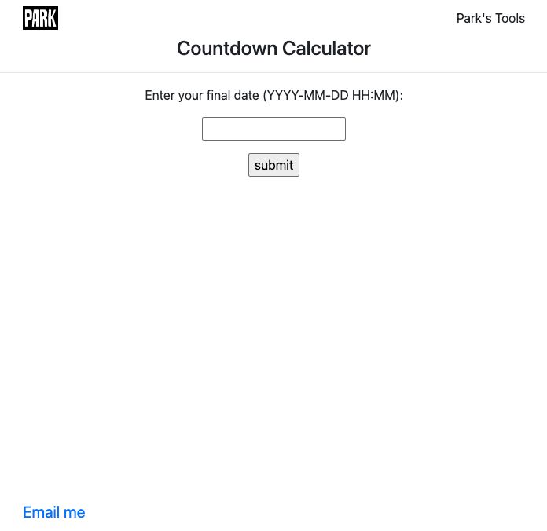

# Countdown_Tool
This repository contains all the files necessary for my Countdown Tool project.

Project overview:

The Countdown Tool is a simple Flask web application that calculates the time remaining until a specified end date. It was built primarily as a learning project to explore the fundamentals of Flask and web app development.

Purpose:
1) Learn and practice Flask, including routing, HTML templating (Jinja2), and session handling.
2) Build the foundational knowledge needed to apply Flask concepts to my other ongoing project.
3) Create a personal countdown calculator that quickly shows the time left until a chosen date.
4) Keep track of my learning progress.

How to run the project:
1) Clone or download this repository.
2) Install all libraries listed in requirements.txt
3) Run 'python app.py' and open your browser to go to the website running on the local server. 

Website homepage

Page with options for inserting a specific date or choosing current date

Results page

